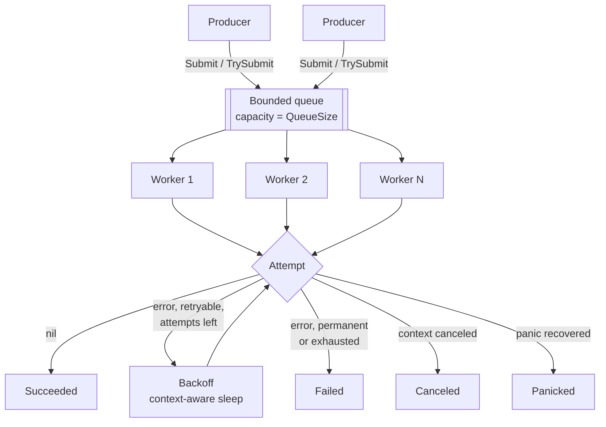
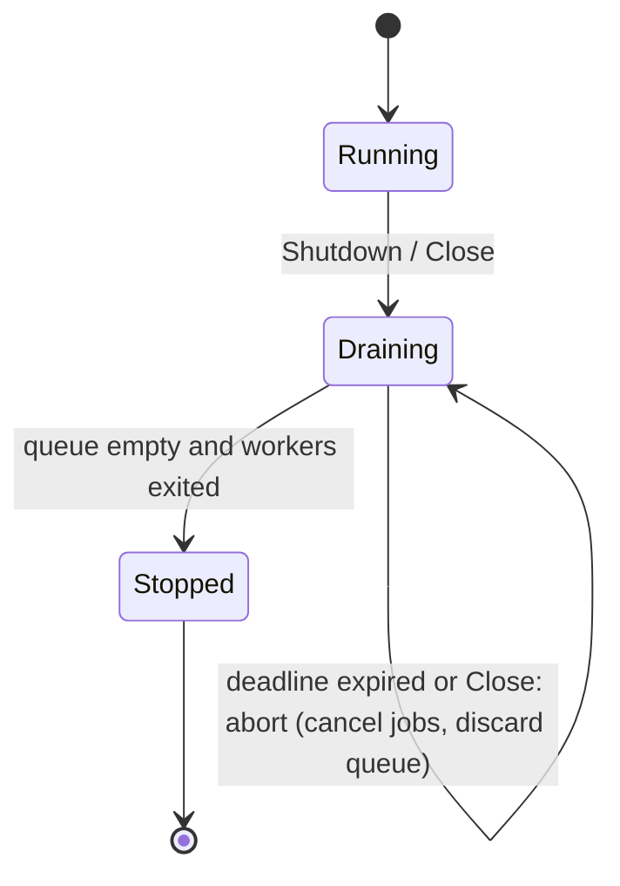

# Concurrent Worker Pool

A bounded, fixed-size worker pool for Go with explicit backpressure, retries with exponential backoff and jitter, per-job cancellation, panic isolation, and a defined graceful-shutdown state machine. Standard library only.

## Overview

Producers submit jobs to a bounded queue; a fixed set of workers executes them. The queue capacity is the single place work can accumulate, so memory use and queueing delay have a hard upper bound. When the queue is full the caller decides what happens: wait (with a context), or be told immediately with `ErrQueueFull`.

```go
pool, err := workerpool.New(workerpool.Config{Workers: 8, QueueSize: 100})
if err != nil {
    log.Fatal(err)
}
defer pool.Shutdown(context.Background())

err = pool.Submit(ctx, workerpool.JobFunc(func(ctx context.Context) error {
    return doWork(ctx)
}))
```

## Why This Exists

Two common ways to run background work in Go fail under load:

1. `go f()` per job. Concurrency is unbounded, so a traffic spike becomes a goroutine spike, then a memory spike, then a downstream overload (database connections, upstream rate limits). Nothing tells the producer to slow down.
2. A worker pool fed by an unbounded queue (slice, linked list, huge channel). The process survives the spike by buffering it, so latency grows without bound and memory follows. The failure is delayed and harder to diagnose, not avoided.

A bounded queue turns overload into an explicit, local decision at the point of submission. This repository implements that idea completely enough to be used, and documents the reasoning behind each design choice.

## Design Goals

- Bounded resources: `Workers` goroutines and `QueueSize` buffered jobs, nothing else grows with load.
- Explicit behaviour at every boundary: full queue, closed pool, canceled context, failed job, panicking job.
- No lost jobs: every accepted job reaches exactly one terminal outcome that is observable.
- Correct shutdown: `Submit` racing `Shutdown` cannot panic, leak, or silently drop a job.
- Small API, standard-library-only, observability through an interface rather than a vendor.

Non-goals: persistence, distribution, priorities, dynamic worker scaling, scheduling of future work. See [Alternatives Considered](#alternatives-considered).

## Architecture



Lifecycle of the pool:



## Concurrency Model

- `Workers` goroutines are started in `New`, each looping over a receive from the queue channel. There is no per-job goroutine.
- The queue is a buffered channel. It is never exposed; callers use `Submit` and `TrySubmit`.
- The queue channel is closed exactly once, by an internal goroutine, only after every in-flight submission has finished. A `sync.RWMutex` plus `sync.WaitGroup` make that precise: submitters register under the read lock only while the state is `Running`; shutdown flips the state under the write lock and then waits for registered submitters. This is why `Submit` cannot send on a closed channel.
- Workers exit when the closed queue is drained. `Done()` closes after all of them have returned.

Details: [docs/concurrency-model.md](docs/concurrency-model.md).

## Backpressure

| Method             | Queue full behaviour                                                                                         |
| ------------------ | ------------------------------------------------------------------------------------------------------------ |
| `Submit(ctx, job)` | Blocks until space is available, `ctx` ends (returns `ctx.Err()`), or shutdown begins (returns `ErrClosed`). |
| `TrySubmit(job)`   | Returns `ErrQueueFull` immediately.                                                                          |

`QueueSize: 0` is an unbuffered hand-off: a submission succeeds only when a worker is ready to receive it. Dropping the oldest job, running the job on the caller's goroutine, and unbounded buffering are deliberately not provided; the tradeoffs are in [docs/backpressure.md](docs/backpressure.md).

## Retry Model

Retries are opt-in (`RetryPolicy` zero value is one attempt). `MaxAttempts` counts executions including the first: `MaxAttempts: 5` is one attempt plus at most four retries.

- Delay before retry `n`: `min(InitialBackoff * Multiplier^(n-1), MaxBackoff)`, then reduced by a random fraction up to `Jitter`, so `MaxBackoff` stays a true ceiling.
- Errors wrapped with `workerpool.Permanent(err)` are never retried; `RetryPolicy.Retryable` replaces the default classifier.
- Panics are never retried. Context cancellation is never retried.
- Retries run on the worker that owns the job; a retrying job never re-enters the queue, so retries cannot inflate queue depth. The cost is that a job in backoff occupies a worker.

Details: [docs/retries.md](docs/retries.md).

## Cancellation

- The context given to `Submit` bounds only the wait for queue space. It does not become the job's context, so an HTTP request context can be passed without canceling background work when the request ends.
- The context given to `Job.Run` is derived from the pool. It is canceled by `Handle.Cancel` (cause `ErrJobCanceled`), by pool abort (cause `ErrAborted`), and by the per-attempt timeout.
- Backoff sleeps end immediately when that context is canceled. A job canceled while queued never runs.
- Cancellation is cooperative: a job that ignores its context cannot be stopped.

Details: [docs/cancellation.md](docs/cancellation.md).

## Graceful Shutdown

`Shutdown(ctx)`:

1. Moves `Running` to `Draining`; new submissions get `ErrClosed`, blocked submitters are released with `ErrClosed`.
2. Lets queued and running jobs finish (including retries in progress).
3. Waits for workers to exit and returns `nil`.
4. If `ctx` ends first, aborts: running jobs' contexts are canceled, queued jobs are discarded and reported as `Canceled`, and `Shutdown` returns an error matching both `ErrShutdownTimeout` and `ctx.Err()`.

`Close()` is the immediate variant. Both are idempotent and safe to call concurrently. Details: [docs/graceful-shutdown.md](docs/graceful-shutdown.md).

## Failure Handling

Every accepted job ends as `Succeeded`, `Failed`, `Canceled`, or `Panicked`. A panic is recovered at the attempt boundary and converted to a `*PanicError` carrying the value, stack, job ID, worker ID and attempt; it is logged at Error level and reported to the observer, never swallowed. A panic in an `Observer` or in a custom `Retryable` classifier is also contained. See [docs/failure-modes.md](docs/failure-modes.md).

## Observability

The pool depends on no metrics library. It exposes:

- `Observer`: eight event callbacks (`JobSubmitted`, `JobRejected`, `JobStarted`, `JobRetried`, `JobCompleted`, `JobFailed`, `JobCanceled`, `JobPanicked`) carrying queue depth, active workers, queue wait, duration, attempt and error.
- `Stats()`: a snapshot of counters and gauges, suitable for a pull-based exporter.
- `Config.Logger` (`*slog.Logger`): Info for lifecycle, Debug for per-job events, Warn for retries and queue saturation (edge-triggered), Error for terminal failures and panics.

Details and integration sketches for Prometheus and OpenTelemetry: [docs/observability.md](docs/observability.md).

## Installation

```sh
go get github.com/michael-emmanuel/concurrent-worker-pool
```

Replace the module path in `go.mod` with your own repository path before publishing. Requires Go 1.22 or newer. Verified with Go 1.22.2 and 1.24.13.

## Quick Start

```go
package main

import (
    "context"
    "fmt"
    "log"

    "github.com/example/concurrent-worker-pool/workerpool"
)

func main() {
    pool, err := workerpool.New(workerpool.Config{Workers: 4, QueueSize: 16})
    if err != nil {
        log.Fatal(err)
    }

    for i := 0; i < 10; i++ {
        i := i
        if err := pool.Submit(context.Background(), workerpool.JobFunc(func(ctx context.Context) error {
            fmt.Println("job", i)
            return nil
        })); err != nil {
            log.Fatal(err)
        }
    }

    if err := pool.Shutdown(context.Background()); err != nil {
        log.Fatal(err)
    }
}
```

Runnable examples live in `examples/`: `basic`, `backpressure`, `retries`, `graceful-shutdown`, `cancellation`, `http-api`. Run one with `go run ./examples/backpressure`.

## Production Example

An HTTP handler accepts a request and defers slow work. It must not block behind a saturated pool, must shed load visibly, and must not leave work half-done on deploy.

```go
pool, err := workerpool.New(workerpool.Config{
    Workers:     4,                       // sized to the downstream's capacity, not to request rate
    QueueSize:   8,                       // bounds queueing delay: about QueueSize/Workers job-durations
    RetryPolicy: workerpool.DefaultRetryPolicy(),
    JobTimeout:  2 * time.Second,         // per attempt
    Logger:      slog.Default(),
    Observer:    metricsObserver{},
})
if err != nil {
    log.Fatal(err)
}

http.HandleFunc("/enqueue", func(w http.ResponseWriter, r *http.Request) {
    err := pool.TrySubmit(workerpool.JobFunc(func(ctx context.Context) error {
        err := callDownstream(ctx)
        if isClientError(err) {
            return workerpool.Permanent(err) // retrying a 4xx does not help
        }
        return err
    }))
    switch {
    case err == nil:
        w.WriteHeader(http.StatusAccepted)
    case errors.Is(err, workerpool.ErrQueueFull), errors.Is(err, workerpool.ErrClosed):
        w.Header().Set("Retry-After", "1")
        http.Error(w, "busy", http.StatusServiceUnavailable)
    default:
        http.Error(w, "internal error", http.StatusInternalServerError)
    }
})

// On SIGTERM: stop HTTP first (no new submissions), then drain within a deadline.
ctx, cancel := context.WithTimeout(context.Background(), 20*time.Second)
defer cancel()
_ = srv.Shutdown(ctx)
if err := pool.Shutdown(ctx); err != nil {
    log.Printf("pool did not drain in time: %v", err) // running jobs canceled, queued jobs discarded
}
```

The complete, runnable version is `examples/http-api`. Its output for a burst of 60 concurrent requests against 4 workers and a queue of 8:

```
burst of 60 requests: 12 accepted (202), 48 shed (503)
pool: submitted=12 rejected=48 succeeded=12 failed=0 retries=5
```

See [docs/production-considerations.md](docs/production-considerations.md) for sizing, downstream limits and retry amplification.

## API

| Symbol                                                                                                                                           | Purpose                                               |
| ------------------------------------------------------------------------------------------------------------------------------------------------ | ----------------------------------------------------- |
| `New(Config) (*Pool, error)`                                                                                                                     | Validate config and start workers.                    |
| `(*Pool).Submit(ctx, Job) error`                                                                                                                 | Enqueue, blocking while full.                         |
| `(*Pool).TrySubmit(Job) error`                                                                                                                   | Enqueue or return `ErrQueueFull`.                     |
| `(*Pool).SubmitTask(ctx, Task) (*Handle, error)`                                                                                                 | `Submit` with ID, per-attempt timeout and a `Handle`. |
| `(*Pool).TrySubmitTask(Task) (*Handle, error)`                                                                                                   | `TrySubmit` with a `Handle`.                          |
| `(*Pool).Shutdown(ctx) error`                                                                                                                    | Graceful drain bounded by `ctx`; abort on expiry.     |
| `(*Pool).Close() error`                                                                                                                          | Immediate abort, waits for workers.                   |
| `(*Pool).Done()`, `State()`, `Stats()`                                                                                                           | Lifecycle and metrics.                                |
| `Handle`: `ID`, `Cancel`, `Done`, `Result`, `Wait`                                                                                               | Track and cancel one job.                             |
| `Job`, `JobFunc`, `Task`, `Result`, `Outcome`                                                                                                    | Work and its outcome.                                 |
| `RetryPolicy`, `DefaultRetryPolicy`, `Permanent`, `IsPermanent`                                                                                  | Retry configuration and classification.               |
| `Observer`, `NopObserver`, `Event`                                                                                                               | Observability hooks.                                  |
| `InfoFromContext(ctx)`                                                                                                                           | Job ID, worker ID and attempt number inside `Run`.    |
| `ErrQueueFull`, `ErrClosed`, `ErrShutdownTimeout`, `ErrAborted`, `ErrJobCanceled`, `ErrRetriesExhausted`, `ErrPanic`, `ErrNilJob`, `*PanicError` | Errors.                                               |

Full reference with semantics: [docs/api.md](docs/api.md) and `go doc ./workerpool`.

## Testing

```sh
go test ./...
go test -race ./...
go vet ./...
```

Tests avoid sleeps for synchronization: they use channels and barriers, an injected sleeper and random source for retries, and watchdog timeouts that only fire on failure. Concurrency tests exercise many producers, saturation with blocked producers, `Submit` racing `Shutdown` (invariant: accepted jobs equal executed jobs), concurrent shutdown callers, abort accounting, and a goroutine-leak check. Coverage measured on the last run of `go test -coverprofile`: 97.5% of statements in `workerpool`. See [docs/testing.md](docs/testing.md).

## Benchmarks

Measured with `go test -run '^$' -bench . -benchmem ./workerpool` on Go 1.24.13, linux/amd64, Intel Xeon @ 2.10GHz, a virtual machine with a single CPU (`nproc` = 1). Results from one run:

| Benchmark                                                     | ns/op | B/op | allocs/op |
| ------------------------------------------------------------- | ----- | ---- | --------- |
| Submit, workers=1, queue=0                                    | 1432  | 208  | 4         |
| Submit, workers=1, queue=16                                   | 656   | 211  | 4         |
| Submit, workers=1, queue=1024                                 | 588   | 211  | 5         |
| Submit, workers=4, queue=16                                   | 631   | 211  | 4         |
| Submit, workers=16, queue=1024                                | 575   | 212  | 5         |
| SubmitParallel, workers=4                                     | 589   | 212  | 5         |
| ExecuteCPU (about 1000 multiply-add steps per job), workers=4 | 2051  | 208  | 5         |
| TrySubmit on a full queue                                     | 257   | 134  | 2         |

How to read these numbers:

- Each `Submit` op includes executing a no-op job, since the benchmark drains the pool before stopping. It measures pool overhead, not useful work.
- On this single-CPU machine, adding workers cannot add parallelism, so these results say nothing about multi-core scaling. That is a limitation of the measurement environment, not a finding. Re-run on your hardware with `make bench`.
- The unbuffered configuration (`queue=0`) costs about twice as much per job as buffered ones here, consistent with a goroutine hand-off per job instead of amortized batching through the buffer.
- Run-to-run variation of several percent is normal; treat differences smaller than that as noise.

## Design Tradeoffs

Summary; the reasoning is in [docs/architecture.md](docs/architecture.md) and [docs/backpressure.md](docs/backpressure.md).

- Channel queue, not a mutex-protected slice. A buffered channel already provides bounded FIFO, blocking with cancellation via `select`, and wake-ups without busy loops. A custom queue would be justified by priorities or removal of queued items, neither of which this pool offers.
- Fixed workers, not autoscaling. Worker count is the concurrency limit protecting downstream systems; automatic growth defeats that purpose. Sizing is a decision surfaced in `Config` (there is no default for `Workers`).
- Pool-owned retries, executed in place on the worker. Retrying in the caller would need every caller to reimplement backoff; re-enqueuing would let retries compete with fresh work and complicate the bounded-queue guarantee. In-place retry keeps the bound but ties up a worker during backoff.
- `Submit`'s context does not become the job's context. Request-scoped contexts are the common input, and background work usually must outlive the request.
- Panic recovery at the attempt boundary. Without it one bad job kills the process; with it, the defect is converted to a reported, non-retried failure. The risk of hiding defects is mitigated by Error-level logging with stack, an observer event, and a counter.
- Cooperative timeouts. The job runs synchronously on its worker; there is no goroutine spawned to abandon on timeout, so a job that ignores its context holds its worker instead of leaking a second goroutine that keeps running concurrently with a retry.
- Observer as an interface with a single `Event` struct, so new fields do not break implementers.

## Failure Modes

| Failure               | Behaviour                                                  | Reason                                | Operational consideration                                         |
| --------------------- | ---------------------------------------------------------- | ------------------------------------- | ----------------------------------------------------------------- |
| Queue full            | `TrySubmit` returns `ErrQueueFull`; `Submit` blocks        | Bounded memory, explicit backpressure | Alert on sustained rejections; it means capacity is below demand  |
| Job returns error     | Retried if policy allows, else `Failed`                    | Transient errors often clear          | Retries multiply downstream load                                  |
| Retries exhausted     | `Failed`, error wraps `ErrRetriesExhausted` and last error | Bounded work per job                  | Persistent failure needs a dead-letter path outside this package  |
| Job panics            | Recovered, `Panicked`, not retried                         | Panic signals a defect                | Investigate every occurrence                                      |
| Context canceled      | `Canceled`, not retried                                    | Not a job failure                     | Job must observe its context                                      |
| Shutdown in progress  | New submissions get `ErrClosed`                            | Stop intake first                     | Stop upstream traffic before pool shutdown                        |
| Shutdown deadline hit | Abort: running canceled, queued discarded                  | Bounded termination time              | Discarded work is lost; size deadline to termination grace period |

The full table with more cases: [docs/failure-modes.md](docs/failure-modes.md).

## Alternatives Considered

- `golang.org/x/sync/errgroup` with `SetLimit`: good for bounded fan-out of a known set of tasks that share a lifetime. It has no long-lived queue, no retries, no rejection semantics.
- A semaphore (`chan struct{}` or `x/sync/semaphore`) around `go f()`: bounds concurrency but not queued work; waiting goroutines are the unbounded queue.
- Third-party pools (for example ants, tunny): reasonable if you need features such as dynamic resizing; this project trades those for a small, auditable core.
- A durable queue (Redis, SQS, Kafka, a database table): necessary when jobs must survive process restarts or be shared across processes. This pool is in-memory by design; see [Future Extensions](#future-extensions) and the engineering review md for how the two compose.

## Future Extensions

Each is deliberately absent, and would be added only with a concrete need:

- Rate limiting in front of workers (see `docs/production-considerations.md` for how to compose `x/time/rate` today).
- Priority or weighted queues.
- A reference `Observer` for Prometheus and OpenTelemetry in separate modules, so the core stays dependency-free.
- Dead-letter callback for jobs that exhaust retries.
- Retry budgets (a shared limit on retries per time window) to prevent retry storms across jobs.

## Known Limitations

- In-memory only: a process crash loses queued and running jobs.
- A job that ignores its context cannot be stopped; a job that calls `runtime.Goexit` terminates its worker goroutine and never gets a reported outcome, permanently reducing capacity (the pool does not replace the worker). This is the one way a job can escape the terminal-outcome guarantee.
- `Shutdown` returns without waiting after an abort; use `Done()` or `Close()` to wait for a job that is slow to react.
- Benchmarks here were measured on a single-CPU machine.

## License

MIT. See [LICENSE](LICENSE).
